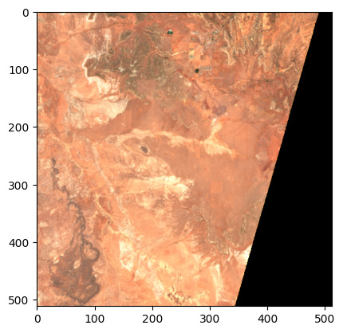

# async-geotiff

Fast, async GeoTIFF and [Cloud-Optimized GeoTIFF][cogeo] (COG) reader for Python, wrapping the Rust-based [Async-TIFF][async-tiff] library.

[async-tiff]: https://github.com/developmentseed/async-tiff
[cogeo]: https://cogeo.org/

## Features

- Read-only support for GeoTIFF and COG formats.
- High-level, familiar, easy to use API.
- Performance-focused:
    - Rust core ensures native performance.
    - CPU-bound tasks like image decoding happen in a thread pool, without blocking the async executor.
    - Buffer protocol integration for zero-copy data sharing between Rust and Python.
- Lightweight with no GDAL dependency.
- Integration with [obstore] for efficient data access on object stores.
- Full type hinting for all operations.
- Broad decompression support: Deflate, LZW, JPEG, JPEG2000, WebP, ZSTD.

**Anti-Features** (features explicitly not in scope):

- No pixel resampling.
- No warping/reprojection.

Resampling and warping bring significant additional complexity and are out of scope for this library.

[obstore]: https://developmentseed.org/obstore/latest/
[obspec]: https://developmentseed.org/obspec/latest/

## Example

First create a "store", such as an [`S3Store`][S3Store], [`GCSStore`][GCSStore], [`AzureStore`][AzureStore], or [`LocalStore`][LocalStore] for reading data from AWS S3, Google Cloud, Azure Storage, or local files. Refer to [obstore] documentation for more information.

[S3Store]: https://developmentseed.org/obstore/latest/api/store/aws/#obstore.store.S3Store
[GCSStore]: https://developmentseed.org/obstore/latest/api/store/gcs/#obstore.store.GCSStore
[AzureStore]: https://developmentseed.org/obstore/latest/api/store/azure/#obstore.store.AzureStore
[LocalStore]: https://developmentseed.org/obstore/latest/api/store/local/#obstore.store.LocalStore

```py
from obstore.store import S3Store

store = S3Store("sentinel-cogs", region="us-west-2", skip_signature=True)
path = "sentinel-s2-l2a-cogs/12/S/UF/2022/6/S2B_12SUF_20220609_0_L2A/TCI.tif"
```

Then open a `GeoTIFF`:

```py
from async_geotiff import GeoTIFF

geotiff = await GeoTIFF.open(path, store=store)
```

On the `GeoTIFF` instance you have metadata about the image, such as its affine transform and Coordinate Reference System:

```py
geotiff.transform
# Affine(10.0, 0.0, 300000.0,
#        0.0, -10.0, 4100040.0)

geotiff.crs
# <Projected CRS: EPSG:32612>
# Name: WGS 84 / UTM zone 12N
```

For a COG, you can access the overviews, or reduced resolution versions, of the image:

```py
# Overviews are ordered from finest to coarsest resolution
# In this case, access the second-coarsest resolution version of the image
overview = geotiff.overviews[-2]
```

Then we can read data from the image. This loads a 512-pixel square from the
upper-left corner of the selected overview.

```py
from async_geotiff import Window

window = Window(col_off=0, row_off=0, width=512, height=512)
array = await overview.read(window=window)
```

This `Array` instance has `data`, `mask`, and some other metadata about the fetched array data.

Plot, using [`rasterio.plot.show`](https://rasterio.readthedocs.io/en/stable/api/rasterio.plot.html#rasterio.plot.show) (requires `matplotlib`):

```py
import rasterio.plot

rasterio.plot.show(array.data)
```


